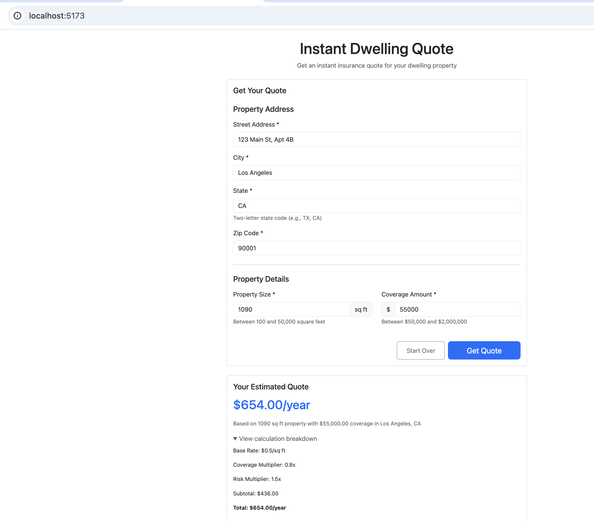
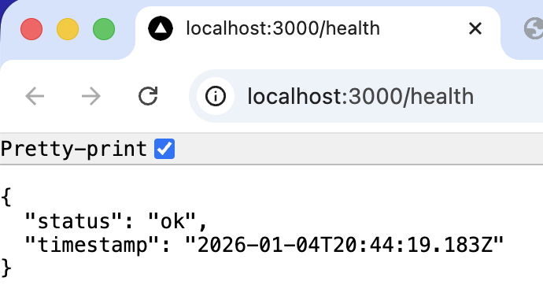

# dw-quote-speckit

This project uses opensource Github speckit with VS code & Github copilot to create a response dwelling quote management website.

## front end working screen shot

## End end working screen shot

